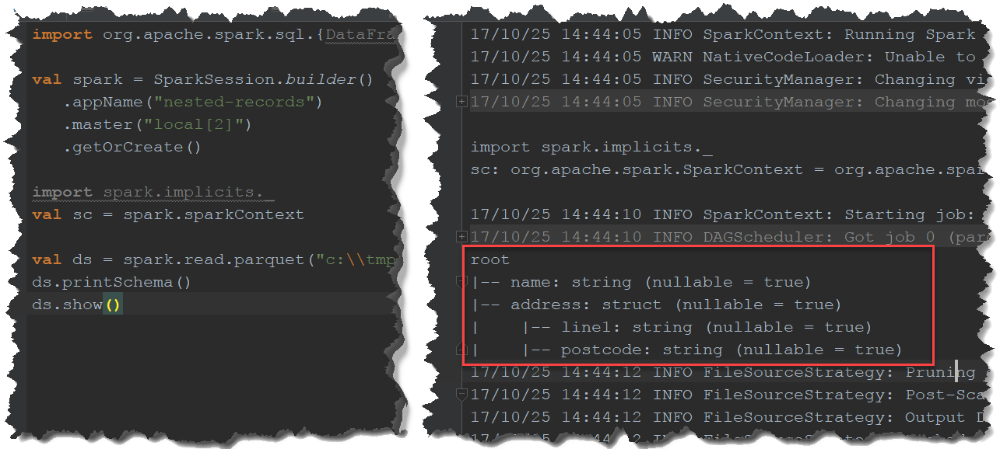
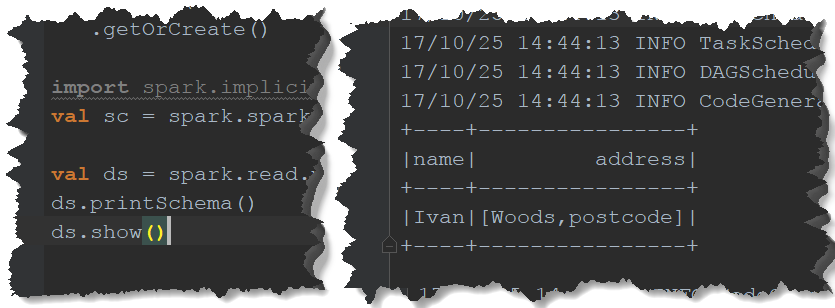

# Complex Data

The library supports reading and writing complex structures since v1.5 (currently in preview).

## Structures

In addition to [specifying basic types](schema.md), schema can contain complex structures. Let's say you have a table defined as:

```json
{
   "name": "Ivan",
   "addressLine1": "Woods",
   "addressPostcode": "postcode"
}
```

to save this data in parquet, you would define the following schema:

```csharp
var schema = new Schema(
   new SchemaElement<string>("name"),
   new SchemaElement<string>("addressLine1"),
   new SchemaElement<string>("addressPostcode"));
```

Although that's not pretty it works perfectly fine. However, another way to express this data would be to have a separate **address** entity:

```json
{
   "name": "Ivan",
   "address": {
      "line1": "Woods",
      "postcode": "postcode"
   }
}
```

The corresponding schema definition is:

```csharp
var schema = new Schema(
   new SchemaElement<string>("name"),
   new SchemaElement<Row>("address",
      new SchemaElement<string>("line1"),
      new SchemaElement<string>("postcode")
);
```

Let's write a file out with one record to `c:\tmp\nested.parquet`:

```csharp
var ds = new DataSet(schema);

//add a new row
ds.Add("Ivan", new Row("Woods", "postcode"));

//write to file
ParquetWriter.WriteFile(ds, "c:\\tmp\\firstnested.parquet");
```

**name** element is expressed as a simple value, whereas because **address** is a nested structure, you have to specify a `Row` with values corresponding to the rows in that structure.

To validate this is working we can write a simple Scala Spark script:

```scala
import org.apache.spark.sql.{DataFrame, SparkSession}

val spark = SparkSession.builder()
   .appName("nested-records")
   .master("local[2]")
   .getOrCreate()

import spark.implicits._
val sc = spark.sparkContext

val ds = spark.read.parquet("c:\\tmp\\nested.parquet")
ds.printSchema()
ds.show()
```

which produces the following output for schema



and data



## Arrays

todo